    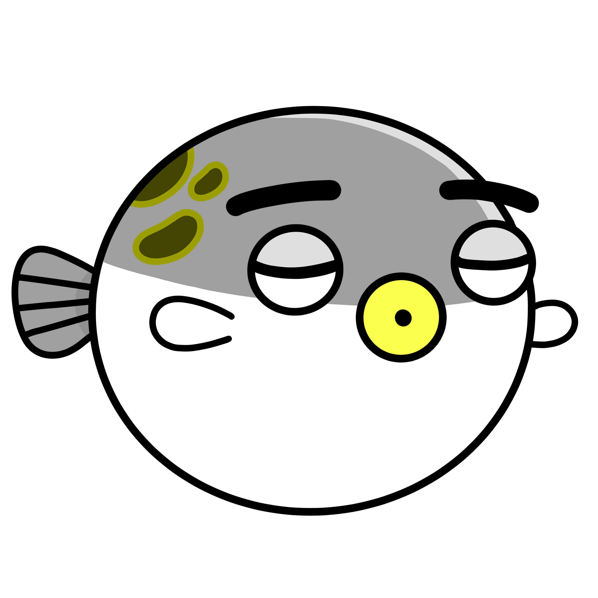

福岡でフロントエンドエンジニアをやっています。

### Follow me on

[-0d1317?style=flat-square&logo=github&logoColor=white)](https://github.com/lollipop-onl)
[-0d1317?style=flat-square&logo=github&logoColor=white)](https://github.com/simochee)

### Biography

:school: 2013/04 - 宇部工業高等専門学校 制御情報工学科 入学
🏢 2018/04 - チームラボ株式会社 入社
🏢 2025/07 - 株式会社ヌーラボ 入社

## Works

### npm Packages

<a href="https://www.npmjs.com/package/@lollipop-onl/myzod-to-zod">
  <picture>
    <source media="(prefers-color-scheme: dark)" srcset="./assets/badges/npm/lollipop-onl-myzod-to-zod@dark.svg">
    <source media="(prefers-color-scheme: light)" srcset="./assets/badges/npm/lollipop-onl-myzod-to-zod@light.svg">
    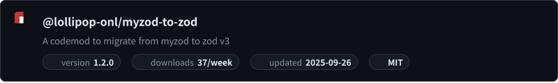
  </picture>
</a>
<a href="https://www.npmjs.com/package/@passport-mrz/builder">
  <picture>
    <source media="(prefers-color-scheme: dark)" srcset="./assets/badges/npm/passport-mrz-builder@dark.svg">
    <source media="(prefers-color-scheme: light)" srcset="./assets/badges/npm/passport-mrz-builder@light.svg">
    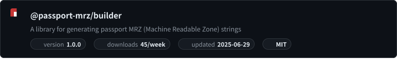
  </picture>
</a>
<a href="https://www.npmjs.com/package/@passport-mrz/renderer">
  <picture>
    <source media="(prefers-color-scheme: dark)" srcset="./assets/badges/npm/passport-mrz-renderer@dark.svg">
    <source media="(prefers-color-scheme: light)" srcset="./assets/badges/npm/passport-mrz-renderer@light.svg">
    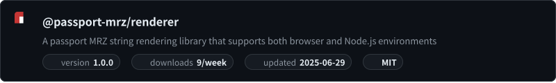
  </picture>
</a>
<a href="https://www.npmjs.com/package/copylen">
  <picture>
    <source media="(prefers-color-scheme: dark)" srcset="./assets/badges/npm/copylen@dark.svg">
    <source media="(prefers-color-scheme: light)" srcset="./assets/badges/npm/copylen@light.svg">
    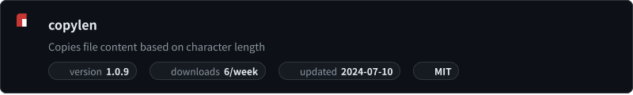
  </picture>
</a>
<a href="https://www.npmjs.com/package/docsify-serve">
  <picture>
    <source media="(prefers-color-scheme: dark)" srcset="./assets/badges/npm/docsify-serve@dark.svg">
    <source media="(prefers-color-scheme: light)" srcset="./assets/badges/npm/docsify-serve@light.svg">
    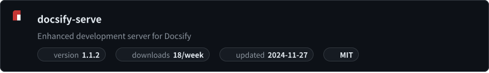
  </picture>
</a>
<a href="https://www.npmjs.com/package/@lollipop-onl/vuex-typesafe-helper">
  <picture>
    <source media="(prefers-color-scheme: dark)" srcset="./assets/badges/npm/lollipop-onl-vuex-typesafe-helper@dark.svg">
    <source media="(prefers-color-scheme: light)" srcset="./assets/badges/npm/lollipop-onl-vuex-typesafe-helper@light.svg">
    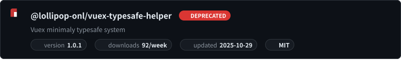
  </picture>
</a>
<a href="https://www.npmjs.com/package/@lollipop-onl/vue-typed-reactive">
  <picture>
    <source media="(prefers-color-scheme: dark)" srcset="./assets/badges/npm/lollipop-onl-vue-typed-reactive@dark.svg">
    <source media="(prefers-color-scheme: light)" srcset="./assets/badges/npm/lollipop-onl-vue-typed-reactive@light.svg">
    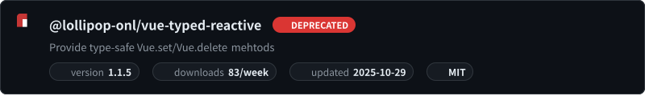
  </picture>
</a>
<a href="https://www.npmjs.com/package/@lollipop-onl/axios-logger">
  <picture>
    <source media="(prefers-color-scheme: dark)" srcset="./assets/badges/npm/lollipop-onl-axios-logger@dark.svg">
    <source media="(prefers-color-scheme: light)" srcset="./assets/badges/npm/lollipop-onl-axios-logger@light.svg">
    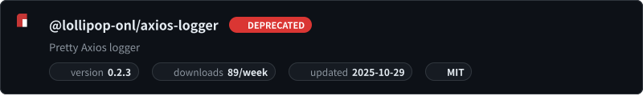
  </picture>
</a>

### Docsify Plugins

<a href="https://www.jsdelivr.com/package/npm/docsify-shiki">
  <picture>
    <source media="(prefers-color-scheme: dark)" srcset="./assets/badges/jsdelivr/docsify-shiki@dark.svg">
    <source media="(prefers-color-scheme: light)" srcset="./assets/badges/jsdelivr/docsify-shiki@light.svg">
    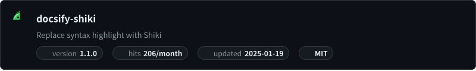
  </picture>
</a>
<a href="https://www.jsdelivr.com/package/npm/docsify-plugin-github-footer">
  <picture>
    <source media="(prefers-color-scheme: dark)" srcset="./assets/badges/jsdelivr/docsify-plugin-github-footer@dark.svg">
    <source media="(prefers-color-scheme: light)" srcset="./assets/badges/jsdelivr/docsify-plugin-github-footer@light.svg">
    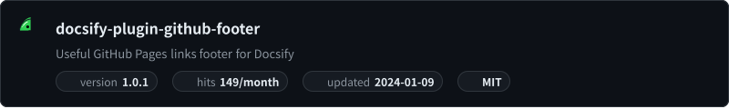
  </picture>
</a>
<a href="https://www.jsdelivr.com/package/npm/docsify-plugin-page-history">
  <picture>
    <source media="(prefers-color-scheme: dark)" srcset="./assets/badges/jsdelivr/docsify-plugin-page-history@dark.svg">
    <source media="(prefers-color-scheme: light)" srcset="./assets/badges/jsdelivr/docsify-plugin-page-history@light.svg">
    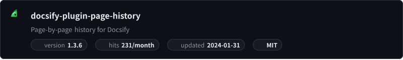
  </picture>
</a>
<a href="https://www.jsdelivr.com/package/npm/docsify-plugin-ga">
  <picture>
    <source media="(prefers-color-scheme: dark)" srcset="./assets/badges/jsdelivr/docsify-plugin-ga@dark.svg">
    <source media="(prefers-color-scheme: light)" srcset="./assets/badges/jsdelivr/docsify-plugin-ga@light.svg">
    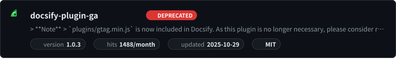
  </picture>
</a>

### Browser Extensions

* [Backlog Pull Request Plus](https://github.com/simochee/backlog-pull-request-plus)  ... Backlog プルリクエストに機能を追加する拡張機能 ([Chrome](https://chromewebstore.google.com/detail/backlog-pull-request-plus/cpafengiapnopbnidfckgambaieonckn)・[Firefox](https://addons.mozilla.org/ja/firefox/addon/backlog-pull-request-plus/))
  
 
* [File Icons for Backlog Git](https://github.com/simochee/file-icons-for-backlog-git)  ... Backlog の Git リポジトリにファイルアイコンを表示する拡張機能 ([Chrome](https://chromewebstore.google.com/detail/aeejnngbcaakhmbcllihmpfijmgaecia)・[Firefox](https://addons.mozilla.org/ja/firefox/addon/file-icons-for-backlog-git/))
  
 
* [Backlog Notification](https://github.com/lollipop-onl/webextensions-backlog-notification) ... Nulab Backlog のお知らせを通知する拡張機能 ([Chrome](https://chrome.google.com/webstore/detail/backlog-notification-exte/gmmfbpjchelnedibjoidghghnigggebn)・[Firefox](https://addons.mozilla.org/ja/firefox/addon/backlog-notification-extension/))
  
 
* [283 PiP](https://github.com/simochee/283-PiP) ... シャニマスを PiP で操作する拡張機能 ([Chrome](https://chromewebstore.google.com/detail/283-pinp/gjpjhdmdbkiabejljimbnjdpmfdonpjb))
  
* [X2B](https://github.com/simochee/X2B) ... X のシェアリンクを Bluesky にリダイレクトさせる拡張機能 ([Chrome](https://chromewebstore.google.com/detail/x2b/caofchgmaapaimkghakiclhlbefjjfbk)・[Firefox](https://addons.mozilla.org/ja/firefox/addon/x2b/))
  
 

### Websites

* [MRZsim](https://passport-mrz.simochee.net) ... パスポートの MRZ 文字列を生成・共有・エクスポートするツール
* [Firefox Release Notes Feed](https://firefox-release-notes.simochee.net/) ... Firefox リリースノートの RSS フィード
* [DirectoryTree Editor](https://tree.lollipop.onl/) ... ディレクトリ構成をインデントから作成するツール
* [Scrapbox TimeMachine](https://scrapbox-timemachine.lollipop.onl/) ... ScrapboxのCommitログから過去の内容を復元するツール
* ~~[Passport MRZ Simulator](https://mrz.lollipop.onl) ... パスポートの MRZ 部分を生成するツール~~
* [第53回 宇部高専高専祭ホームページ](http://nitucfes53.web.fc2.com/) ... 学生時代に作成した文化祭の公式サイト
* [宇部高専鉄道研究愛好会 - URRC](http://urrc.web.fc2.com/) ... 学生時代に作成した鉄道愛好会の公式サイト
* 結婚式 Web招待状 (非公開) ... 自身の結婚式で Web 招待状を自作。併せて、回答の LINE 通知など周辺の機能も実装
* 結婚式 Webアルバム（非公開） ... 自身の結婚式の写真を Web で閲覧できるサイトを自作。パスワードによる認証と署名付きURLによる画像参照で部外者からの閲覧を制限

### Articles

* [はじめてのvue-property-decorator (nuxtにも対応） - Qiita](https://qiita.com/simochee/items/e5b77af4aa36bd0f32e5)
* [TypeScriptでVue.set/deleteを型安全にするライブラリ作った - Qiita](https://qiita.com/simochee/items/89f4b17fe971b4571961)
* [TypeScript 4.1 の Template Literal Types を試してみよう | Zenn](https://zenn.dev/lollipop_onl/articles/ef532c02fc51db20d832)
* [Chrome DevTools Console で使える便利なコマンド | Zenn](https://zenn.dev/lollipop_onl/articles/eoz-devtools-console-commands)
* [TypeScript 4.1 で追加された noUncheckedIndexedAccess とは何か | Zenn](https://zenn.dev/lollipop_onl/articles/eoz-ts-no-unchecked-indexed-access)
* [短いクラス名で運用できる CSS設計 rscss を CSS Modules 向けにアレンジしてみた | Zenn](https://zenn.dev/lollipop_onl/articles/eoz-rscss-in-css-modules)
* [誤用しがちな Promise.all | Zenn](https://zenn.dev/lollipop_onl/articles/mistake-promise-all)
* [JavaScript で Invalid Date を判定する | Zenn](https://zenn.dev/lollipop_onl/articles/eoz-judge-js-invalid-date)
* [PostCSS で先取りする、未来の CSS 7選 | Zenn](https://zenn.dev/lollipop_onl/articles/ac21-future-css-with-postcss)
* [GitHub Actions で動的な環境変数を実現する | Zenn](https://zenn.dev/lollipop_onl/articles/gha-conditional-env)

### Templates

* [simochee/wxt-template](https://github.com/simochee/wxt-template)
* [simochee/create-docsify-plugin](https://github.com/simochee/create-docsify-plugin)
* [simochee/create-cli](https://github.com/simochee/create-cli)
* [lollipop-onl/react-app](https://github.com/lollipop-onl/react-app)
* [lollipop-onl/raycast-extention](https://github.com/lollipop-onl/raycast-extention)

### Books

* [Stylish ESLint Rules こだわりのコードを実現する63のルール](https://booth.pm/ja/items/1827156)
* [GitHub Actions Recipe フロントエンドエンジニアのためのレシピ集](https://lollipoplauncher.booth.pm/items/1827162)

### Events

* [（前編）チームラボがサイトリニューアルを担当したZIPAIR公式Webサイトの開発裏側をインタビューして頂きました！｜チームラボ採用『解体新書』](https://note.team-lab.com/n/nef60bd04a6a6)
* [Frontend Architecture of teamLab - Speaker Deck](https://speakerdeck.com/simochee/frontend-architecture-of-teamlab)
* [育てるゴミ分別案内LINEボット](https://www.city.ube.yamaguchi.jp/shisei/keikaku/jouhoudenshi/opendata/contest2017/contest2017result.html) ... 第3回オープンデータアプリコンテスト宇部にて最優秀賞・特別賞を受賞した作品
* [Ube Emergency Tools(UET)](https://www.city.ube.yamaguchi.jp/shisei/keikaku/jouhoudenshi/opendata/contest_16.html) ... 第2回オープンデータアプリコンテスト宇部にて特別賞を受賞した作品

### Photos

Toggle Photo Gallery

|  |   |
| --- | --- |
| <small><b>トワイライトエクスプレス瑞風のぼり初便を安岡駅付近で</b> <i>2017/06/19 撮影</i></small> | <small><b>浦安市船籍のマークトウェイン号を東京ディズニーランドにて</b> <i>2021/05/10 撮影</i></small> |

